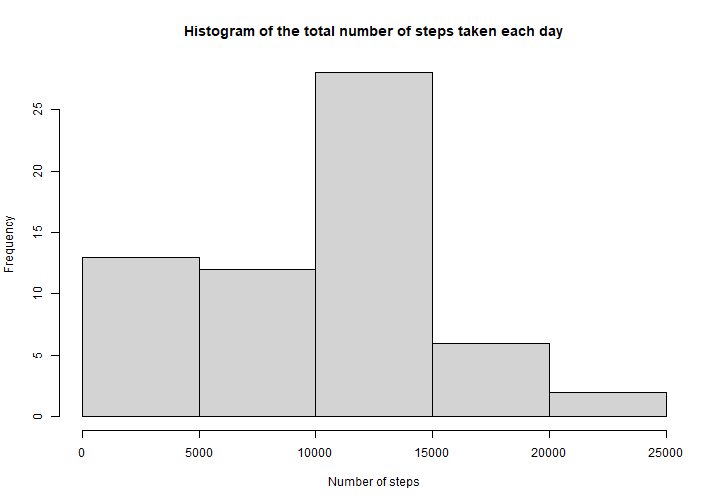
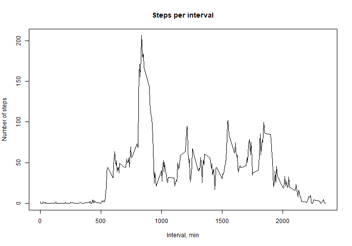
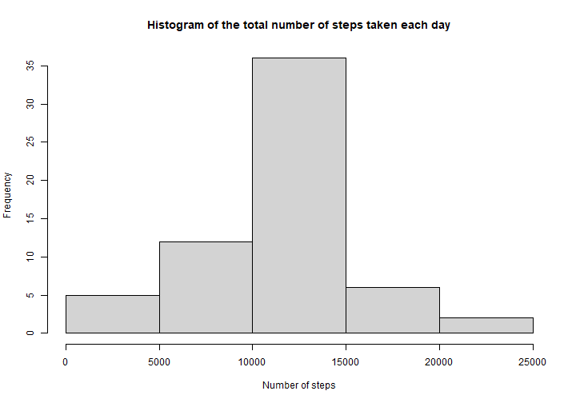
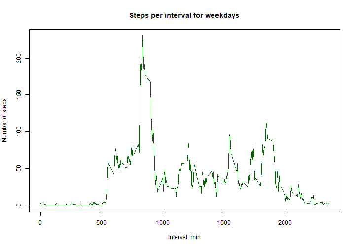
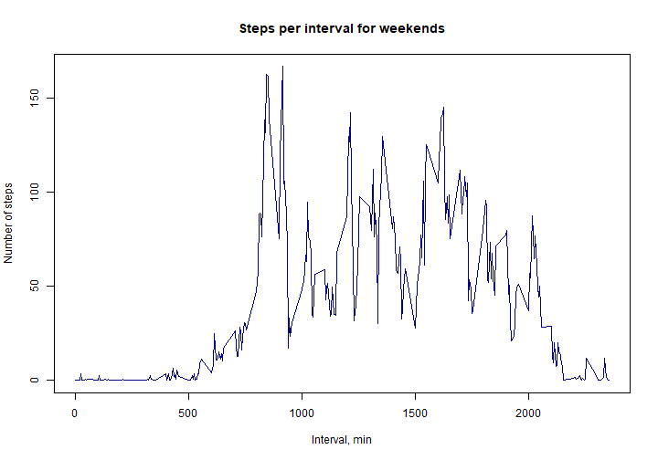

# Reproducible Research - Course Project 1

## Loading and preprocessing the data

```r
Activity <- read.csv(file = "./activity.csv", header = TRUE, sep = ",")
head(Activity)
```

```
##   steps       date interval
## 1    NA 2012-10-01        0
## 2    NA 2012-10-01        5
## 3    NA 2012-10-01       10
## 4    NA 2012-10-01       15
## 5    NA 2012-10-01       20
## 6    NA 2012-10-01       25
```

```r
tail(Activity)
```

```
##       steps       date interval
## 17563    NA 2012-11-30     2330
## 17564    NA 2012-11-30     2335
## 17565    NA 2012-11-30     2340
## 17566    NA 2012-11-30     2345
## 17567    NA 2012-11-30     2350
## 17568    NA 2012-11-30     2355
```

## What is mean total number of steps taken per day?
Process/transform the data into a format suitable for your analysis: calculate the total number of steps taken per day.

```r
library(dplyr)
```

```
## 
## Attaching package: 'dplyr'
```

```
## The following objects are masked from 'package:stats':
## 
##     filter, lag
```

```
## The following objects are masked from 'package:base':
## 
##     intersect, setdiff, setequal, union
```

```r
Grouped <- group_by(Activity, date)
StepsPerDay <- summarise(Grouped, SumPerDay = sum(steps, na.rm = TRUE))
```

```
## `summarise()` ungrouping output (override with `.groups` argument)
```

The histogram of the total number of steps taken per day:

```r
hist(StepsPerDay$SumPerDay, main = "Histogram of the total number of steps taken each day", xlab = "Number of steps")
```


Calculate the mean and the median of the total number of steps taken per day:

```r
mean <- mean(StepsPerDay$SumPerDay)
median <- median(StepsPerDay$SumPerDay)
```
### Answer: The mean and the median of the total number of steps taken per day is 9354.2295082 and 10395, respectivly.

## What is the average daily activity pattern?
Process/transform the data into a format suitable for your analysis:

```r
library(dplyr)
Grouped <- group_by(Activity, interval)
StepsPerInterval <- summarise(Grouped, MeanPerInterval = mean(steps, na.rm = TRUE))
```

```
## `summarise()` ungrouping output (override with `.groups` argument)
```
A time series plot of the 5-minute interval (x-axis) and the average number of steps taken, averaged across all days (y-axis):

```r
plot(x = StepsPerInterval$interval, y = StepsPerInterval$MeanPerInterval, type = "l",
     xlab = "Interval, min", ylab = "Number of steps", main = "Steps per interval")
```


Calculate 5-minute interval which contains the maximum number of steps:

```r
maxSteps <- max(StepsPerInterval$MeanPerInterval)
interval <- StepsPerInterval$interval[StepsPerInterval$MeanPerInterval == maxSteps]
intNumber <- interval/5 + 1
```
### Answer: Interval "168" (on 835 minute) contains the maximum number of steps.

## Imputing missing values
Calculate and report the total number of missing values in the dataset (i.e. the total number of rows with NA):

```r
missingValues <- sum(is.na(Activity$steps) | is.na(Activity$date) | is.na(Activity$interval))
```
### The total number of missing values in the dataset is 2304 rows.

Fill in all of the missing values in the dataset. You could use the mean for that 5-minute interval. Create a new dataset that is equal to the original dataset but with the missing data filled in.

```r
ActivityImp <- Activity
for(i in 1:nrow(ActivityImp)) {
        if(is.na(ActivityImp$steps[i])) {
                ActivityImp$steps[i] <- StepsPerInterval$MeanPerInterval[StepsPerInterval$interval == ActivityImp$interval[i]]
        }
}
```
Make a histogram of the total number of steps taken each day:

```r
library(dplyr)
Grouped <- group_by(ActivityImp, date)
StepsPerDayImp <- summarise(Grouped, SumPerDay = sum(steps, na.rm = TRUE))
```

```
## `summarise()` ungrouping output (override with `.groups` argument)
```

```r
hist(StepsPerDayImp$SumPerDay, main = "Histogram of the total number of steps taken each day", xlab = "Number of steps")
```


Calculate and report the mean and median total number of steps taken per day:

```r
meanImp <- mean(StepsPerDayImp$SumPerDay)
medianImp <- median(StepsPerDayImp$SumPerDay)
```
### The mean and the median of the total number of steps taken per day is 1.0766189 &times; 10<sup>4</sup> and 1.0766189 &times; 10<sup>4</sup>, respectivly.
### Question: "Do these values differ from the estimates from the first part of the assignment? What is the impact of imputing missing data on the estimates of the total daily number of steps?"
### Answer: These values differ from the mean and median values from the first part of the assignment, because we do the imputation and add some values that increase the total daily number of steps.

## Are there differences in activity patterns between weekdays and weekends?
Create a new factor variable in the dataset with two levels – “weekday” and “weekend” indicating whether a given date is a weekday or weekend day:

```r
ActivityImp$weekdays <- weekdays(as.Date(Activity$date, format = "%Y-%m-%d"), abbreviate = TRUE)
ActivityImp$weekdays[ActivityImp$weekdays %in% c("Пн", "Вт", "Ср", "Чт", "Пт")] <- "weekday"
ActivityImp$weekdays[ActivityImp$weekdays %in% c("Сб", "Вс")] <- "weekend"
table(ActivityImp$weekdays)
```

```
## 
## weekday weekend 
##   12960    4608
```
A panel plot containing a time series plot of the 5-minute interval (x-axis) and the average number of steps taken, averaged across all weekday days or weekend days (y-axis):

```r
library(dplyr)
Grouped <- group_by(ActivityImp, interval, weekdays)
StepsPerIntervalImp <- summarise(Grouped, MeanPerInterval = mean(steps))
```

```
## `summarise()` regrouping output by 'interval' (override with `.groups` argument)
```

```r
plot(x = StepsPerIntervalImp$interval[StepsPerIntervalImp$weekdays == "weekday"],
     y = StepsPerIntervalImp$MeanPerInterval[StepsPerIntervalImp$weekdays == "weekday"], col = "dark green",
     type = "l", xlab = "Interval, min", ylab = "Number of steps", main = "Steps per interval for weekdays")
```



```r
plot(x = StepsPerIntervalImp$interval[StepsPerIntervalImp$weekdays == "weekend"],
     y = StepsPerIntervalImp$MeanPerInterval[StepsPerIntervalImp$weekdays == "weekend"], col = "dark blue",
     type = "l", xlab = "Interval, min", ylab = "Number of steps", main = "Steps per interval for weekends")
```




